<font size=5>**Docker学习笔记**</font>

------

# 1. Docker初识

## 1.1. Docker是什么

## 1.2. Docker的作用

## 1.3. Docker的优点

## 1.4. 容器化与虚拟化

# 2. Docker安装

## 2.1. 环境介绍

## 2.2. 安装步骤

1)  yum 包更新到最新

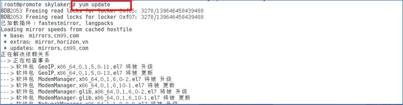

如果遇到如下错误，说明yum在锁定状态中，可以查找yum进程强制关掉：

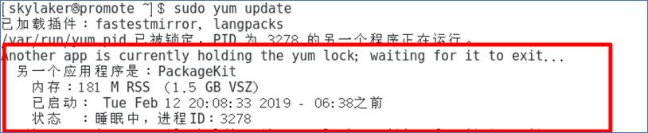

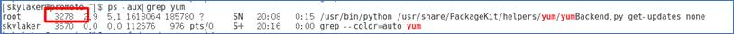

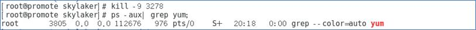

2) 先删除旧版本docker，因为centos系统默认会带docker，不过版本比较旧

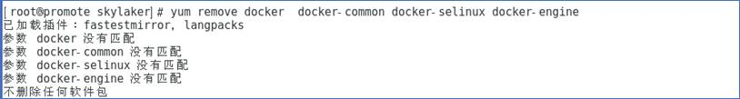

3) 安装docker, yum-util 提供yum-config-manager功能，另外两个是devicemapper驱动依赖的

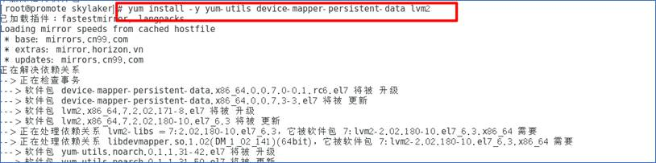

4) 设置yum源

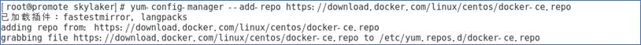

5) 查看所有仓库中所有docker版本，并选择特定版本安装

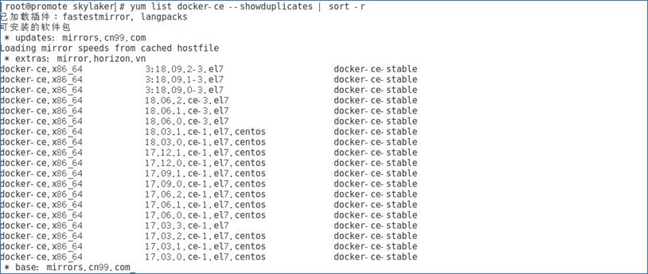

6) 由于国外安装镜像访问缓慢，所以配置国内镜像

这里给出几种加速配置方法：https://www.cnblogs.com/brianzhu/p/8565411.html，推荐daocloud：https://www.daocloud.io/mirror，因为阿里云之前配置了下载还是下载不动~~~

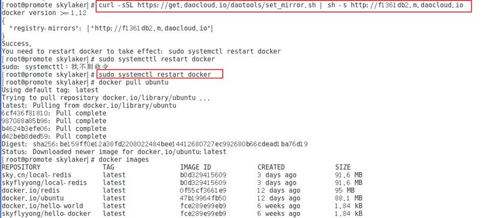

配置完地址重启下docker就行，然后就可以体验飞一般的感觉~~~

7) 默认安装最新稳定版本

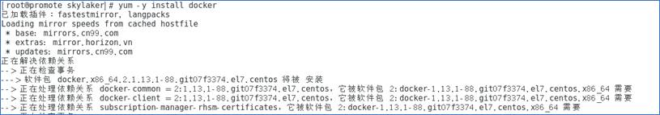

8) 启动docker服务

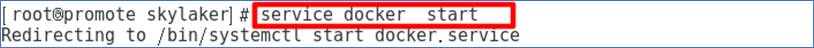

9)  安装完成，可以查看下版本信息

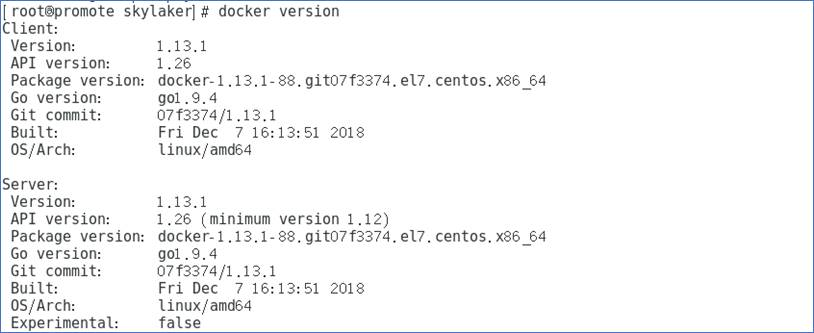

10)   初试牛刀，跑个demo压压惊：**docker run hello-world**

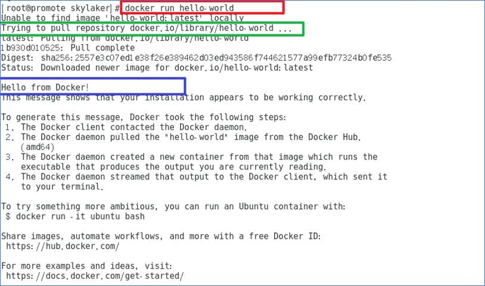

需要注意的是这里并不是类似Java直接用System.out.prinln(“hello-world”)用docker去输出hello-world内容，而是下载了一个叫做hello-world的docker镜像，镜像里相当于有个应用程序，然后运行里面的程序，输出了”Hello from Docker！“等内容。 

11) 每次启动系统我们可以手动启动docker：**sudo service docker start**，

不过有些费事，可以设置docker 开机启动：**systemctl enable docker**


## 2.3. 环境配置

后期在使用docker的时候，我们需要获取各种各样的镜像，国外镜像同样下载缓慢，所以我们可以配置系统docker阿里云镜像，以加速访问下载。

地址：https://cr.console.aliyun.com/cn-hangzhou/mirrors

找到对应的环境，按照步骤操作即可，CentOS可以直接复制红框代码运行：

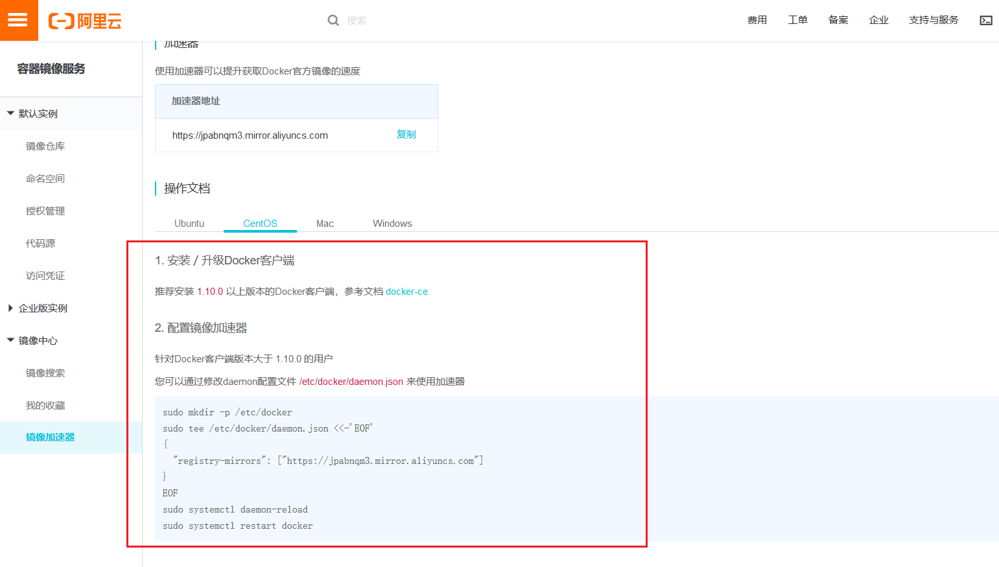

# 3. Docker基本概念

## 3.1. 镜像

在实际生活生产中，工厂要生产某个东西，例如造个飞机，肯定不会冲上去就是一顿操作，而是一群设计师设计出飞机基本模型，后期根据模型生产，可以生产同样型号的飞机很多架；编程语言中，我们在Java中创建一个对象实例，这个实例哪来的？就是根据我们定义的模型对象new出来的。同样的在docker中镜像就相当于模型的概念，我们可以通过这个镜像创建多个镜像实例。对应某个特定的镜像来说，它只能有一个，但是镜像实例可以有很多很多……


镜像的本质就是文件，其实我们写的各种程序也都是文件了，废话了……

我们开发中常用的各种中间件都有对应的docker镜像，例如MySQL，我们在centos上使用MySQL不一定说一定要安装MySQL，我们可以下载对应的MySQL  docker镜像，运行实例即可，便能愉快的使用MySQL。这些中间件的docker镜像官方都会提供，我们可以直接下载使用。

另外我们可以自定义镜像，例如我们开发了某个Java应用程序，需要部署到项目现场，但是会有多个现场需要部署，而我们知道部署程序的话会很麻烦，一堆依赖的环境需要配置，每个线程都需要安装配置一遍，很浪费人力，所以我们可以将我们的项目程序和相关依赖环境制作成镜像，直接放到现场生产环境生成实例启动即可，简单高效。

## 3.2. 容器


上面介绍了镜像的概念，镜像可以创建多个实例，这个实例就是指容器。Docker利用容器来运行应用。

容器是镜像创建的实例，可以被创建、启动、开始、停止、删除。同时不同容器之间是相互隔离的，这就保证了安全性，但是容器之间是可以通过开放的端口相互通信的，不然一个完全封闭的容器是肯定没有意义的。

可以把容器看做是一个简易版的 Linux 环境（包括root用户权限、进程空间、用户空间和网络空间等）和运行在其中的应用程序。

## 3.3. 仓库

既然我们知道有很多现有的镜像可以使用，那么这些镜像在哪呢？这就是仓库的概念。仓库用来存放镜像的。Docker官方提供了docker仓库给我们，我们可以连接下载所需要的镜像。

我们安装的软件会有各种版本，而镜像也是有各种版本的，只不过用一个叫标签（tag）的东西来区分。

# 4. 镜像操作

本章先接触下docker镜像的基础操作。

## 4.1. 查看镜像

命令：**docker images**

列出当前环境下已有的镜像，因为在上一章我们通过docker run hello-world从官网下载了一个hello-world的镜像，所有这里正显示该镜像。

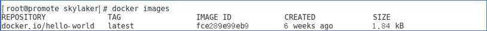

​      信息列含义：

| **REPOSITORY**          | **TAG**                         | **IMAGE ID** | **CREATED** | **SIZE**     |
| ----------------------- | ------------------------------- | ------------ | ----------- | ------------ |
| 镜像仓库用户名/镜像名称 | 镜像版本标签   latest表示最新版 | 镜像唯一ID   | 创建时间    | 镜像文件大小 |

## 4.2.  获取镜像

Ø  命令：**docker pull [镜像名称:版本]**

当我们在本地主机上使用一个不存在的镜像时 Docker 就会自动下载这个镜像。如果我们想预先下载这个镜像，我们可以使用 docker pull 命令来下载它，例如我们想下载ubuntu镜像：

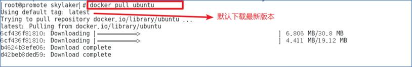

当我们下载的时候没有显示指定要下载的版本，默认下载最新版本，即latest版本，我们可以从日志信息看到。

Ø  那我们下载的镜像存储在了本机哪个位置呢？

进入**cd  /var/lib/docker/**

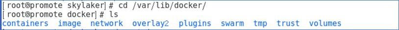进入containers，每一个序列号，都是一个镜像

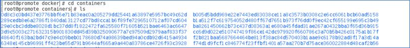

查看镜像目录结构

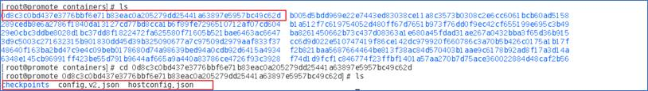

## 4.3.  查找镜像

命令：**docker search [镜像名称]**

我们不确定是否存在一个我们想要的镜像，或者想知道某个镜像有哪些版本，可以通过search命令来查找：

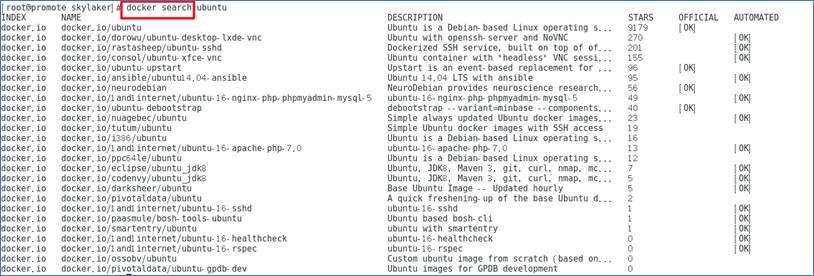

信息列含义：

| **INDEX** | **NAME** | **DESCRIPTION** | **STARTS** | **OFFICIAL** | **AUTOMATED**    |
| --------- | -------- | --------------- | ---------- | ------------ | ---------------- |
| 镜像来源  | 镜像名称 | 镜像描述        | 收藏数     | 是否官方镜像 | 是否能自动化构建 |

我们可以进一步过滤查找镜像，通过命令：**docker search [OPTIONS] [目标镜像]**

OPTIONS说明：

   --automated :只列出 automated build类型的镜像；

  --no-trunc :显示完整的镜像描述；

   -s :列出收藏数不小于指定值的镜像。

例如：列出stars数量大于100的ubuntu镜像

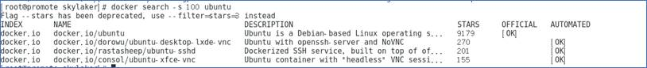

不过这里我们看到这种语法命令已经过时了，并给出了新的语法~~~

## 4.4. 镜像标签

命令：**docker tag [镜像ID/镜像名称] [Tag内容]**

我们可以使用 docker tag 命令，为镜像添加一个新的标签，相当于起别名。

例如示例：

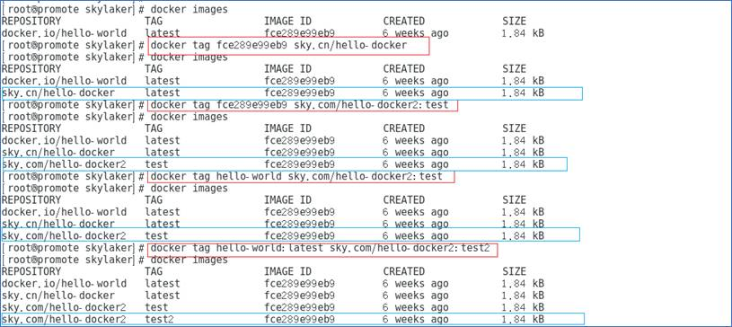

我们可以看到即使创建了多个Tag，但是镜像的ID始终是不变的，即还是同一个镜像本身。

## 4.5.  删除镜像

命令：**docker rmi [镜像名称/镜像ID/镜像Tag标签]**

删除操作rmi命令可以跟不同的内容：

* **镜像名称**：删除默认最新版本latest的镜像，不影响其他Tag的镜像，即镜像文件本身还是存在的，只不过换个名字继续生存下去而已； 

* **镜像ID**：删除指定标签版本镜像；

* **Tag标签**：同一个镜像可以设置多个Tag标签，相当于别名，如果删除指定Tag，那么只会删除该Tag，而不影响镜像文件本身。

例如以下实例：

我们先来为已有的镜像hello-world设置多个Tag:


* 我们先删除指定Tag的镜像试试：

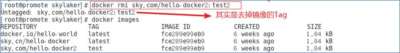

这个从日志看出其实是去掉该镜像的Tag标签。

* 删除指定镜像ID

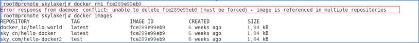

因为当前删除的镜像有正在运行的容器，所以不能直接删除，我们可以查看下正在运行的容器核实下：

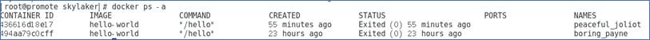

如果实在想删除的话（后果自负），可以强制命令删除：

**docker rmi -f [镜像名称/镜像ID/镜像Tag标签]**

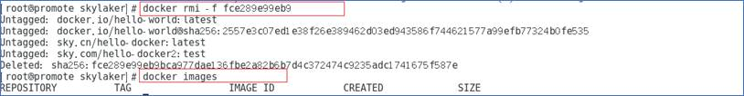

* 删除指定镜像名称

我们先重新下载下hello-world镜像并设置多个tag，现在有如下镜像：

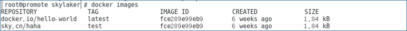

执行删除

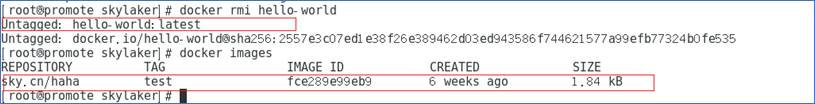

删除默认latest版本Tag，其他Tag继续存在。

## 4.6. 创建镜像

我们目前使用的镜像都是从官方下载的，那么我们可以自己制作镜像吗？那是肯定的，我们可以将容器构建成镜像。我们先来简单试试，先不着急用我们写的代码应用构建镜像，我们用下载的ubuntu镜像创建一个容器，然后在容器中添加一些内容，然后打包成一个新的镜像。即步骤：

下载ubuntu镜像——>创建容器——>添加内容——>打包成新镜像。

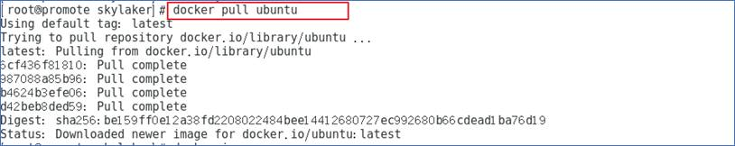

下载完成后，我们使用**docker run -t -i ubuntu bash** 命令启动ubuntu


这里参数-t -i 含义：-t让docker分配一个[伪终端](https://www.baidu.com/s?wd=伪终端&tn=24004469_oem_dg&rsv_dl=gh_pl_sl_csd)并绑定到容器的标准输入上, -i则让容器的标准输入保持打开。概念解释比较费解，这里直白说明下，就是我们现在如果使用的直接是电脑安装的ubuntu系统，我们是不是可以打开一个命令行窗口进行狂敲命令进行操作系统？那么我们现在使用的只是ubuntu docker镜像容器而已，可以看成一个简化的ubuntu系统，那容器是相对封闭的对象，我们怎么进入里面打开命令行窗口操作呢？土遁之术？我们再怎么操作，我们现在能看到的系统界面肯定都是CentOS系统了，我们不好直接进入ubuntu容器内部，但是我们可以将它的命令行终端映射到当前CentOS系统终端啊！我们CentOS的终端就相当于连接ubuntu容器的键盘和显示器了，可以进行相应的ubuntu命令操作。

我们可以看看ubuntu系统内部的目录内容：

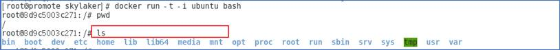

现在我们创建一个新的文本，并输入一些内容, 可以查看下创建的文本已经生成：


exit推出ubuntu容器终端。

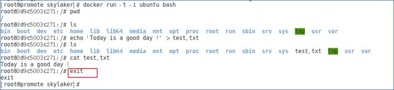

最后一步打包生成镜像：

**docker commit -a=[指定镜像作者] -m=[提交的描述信息] [容器ID] [镜像名称、Tag]**

```
例如：docker commit -m="新增镜像" -a="永" e218edb10161 skyflyyong/hello:v1，
```

查看镜像列表发现多了我们新生成的镜像：

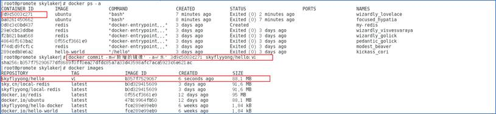

我们可以运行我们生成的镜像来创建一个容器，查看下我们之前构建的内容是否存在：

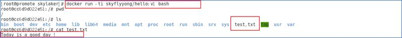

# 5. 容器操作

## 5.1. 查看容器

查看当前系统容器：**docker ps [-a]**

* 不加-a参数表示查询正在运行的容器

* 加-a参数表示查询所有容器，包括正在运行的和已经停止的

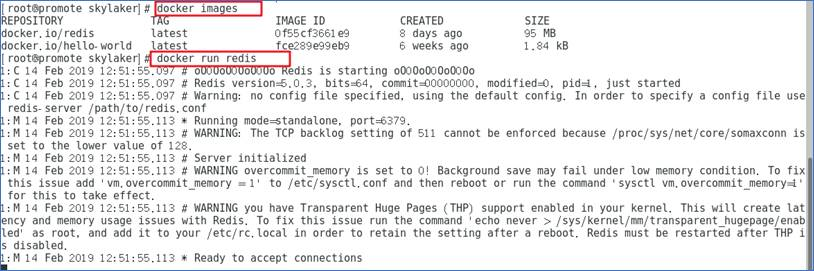

我们运行了redis这个容器，这个时候注意因为我们直接采用前台输出而非服务的形式启动容器，所以我们没法直接继续输入命令，而ctrl+c又会停止容器，所以我们新建一个窗口继续

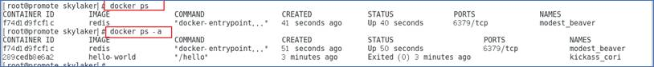

可以看到正在运行的容器为redis容器，通过docker ps -a 可以查看到已经停止运行的hello-world镜像对应的容器。这里需要注意下因为hello-world镜像对应的程序只是简单输出内容，启动后执行完程序便直接结束了，所以我们一般是看不到正在运行的hello-world镜像的容器~~~

## 5.2. 创建容器

命令：**docker create –name [容器名称] [镜像名称]**

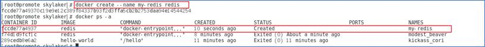

我们可以运行创建的容器：

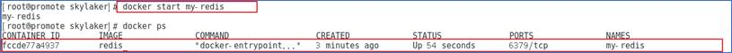

## 5.3.   运行容器

命令：**docker start [容器名称或者容器ID]**


停止后再用ID启动

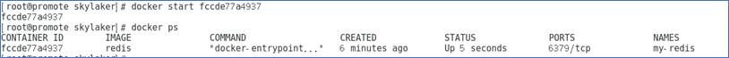

可以看到效果一样，都是可以启动容器的

* 命令2：**docker run [-d]  [镜像名称或者镜像ID]**

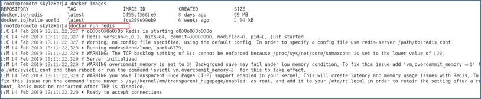

docker start 启动的是已经存在的容器，而docker run 操作对象是镜像，即创建容器、启动容器，而且会先检查镜像是否存在，不存在还会先下载，具体而言，docker run内部步骤：

**1)**      检查本地是否存在制定的镜像，不存在就从公有仓库下载。

**2)**      利用本地镜像创建并启动一个容器。

**3)**      分配一个文件系统，并在只读的镜像层外面挂载一层可读写层。

**4)**      从宿主机配置的网桥接口桥接一个虚拟接口到容器中去。

**5)**      从地址池配置一个IP地址给容器。

**6)**      执行用户的指定的用户程序。

**7)**      执行完毕后容器被终止。

在上面redis示例中我们启动redis容器后是处于前台显示模式的，那么如何让容器以后台服务形式运行呢?可以通过加**-d参数让容器以后台守护进程方式运行**。

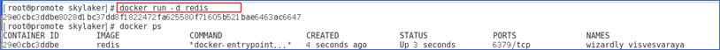

## 5.4.   停止容器

命令：**docker stop [容器名称或者ID]**

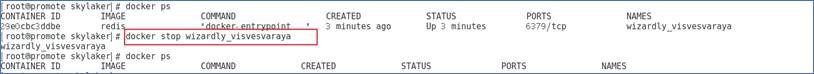

需要注意的是，当容器中的应用终结时，容器也会自动停止，这也是为什么hello-world启动完成后我们查看正在运行的容器却没有它的原因，而redis这些服务中间件肯定需要一直运行的，所以容器也是处于一个运行状态。

## 5.5.   删除容器

命令：**docker rm [-f]  [容器名称或者ID]**

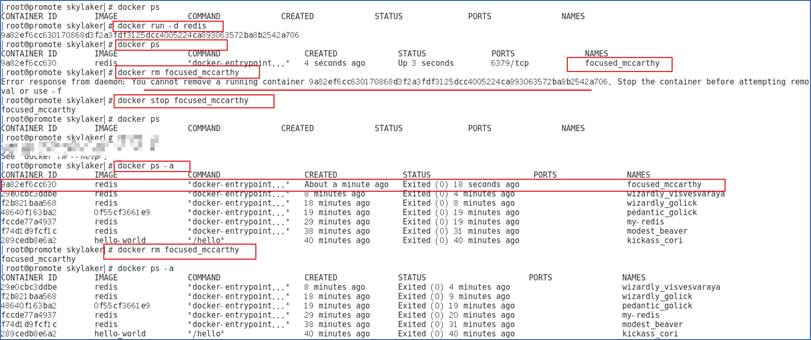

可以看到我们正常无法删除一个正在运行的容器，需要先停止后再删除，当然如果非要以暴力的方式删除也行：

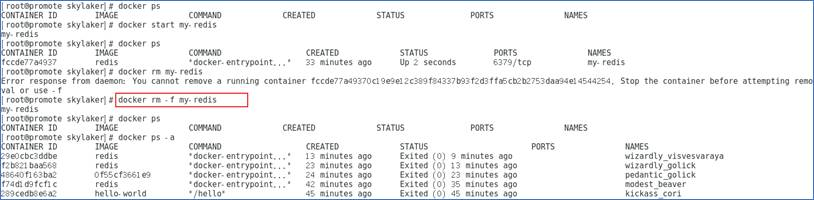

## 5.6. 进入容器

命令：**docker exec [-i] [-t] [容器名称或ID] [bash]**

对于类似ubuntu这样的容器，我们一般需要在其内部进行一些操作，但如果我们直接以-d后台守护进程的方式运行，没法直接启用伪终端连接绑定到容器标准输入上，我们可以通过exec命令来完成绑定，达到进入容器目的。

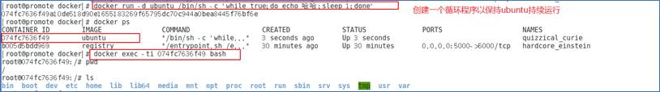

## 5.7. 导入导出容器

导出容器命令：**docker export [容器名称或者ID] > [文件名称]**

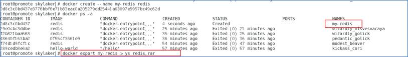

导出到文件ys_redis.rar，查看当前目录

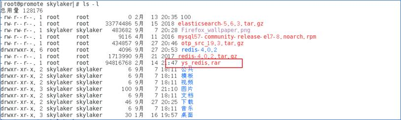

可以看到生成的压缩文件

导入命令：**docker import**

通过导入命令将生成的容器压缩文件解析成新的镜像

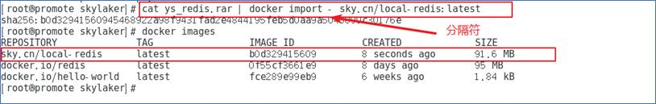

可以看到导入后新生成了镜像，需要注意导入时import后需要分割符-。

运行新生成的镜像：

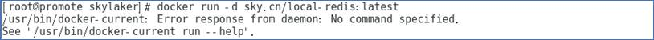

可以看到报错了，这是因为运行导入的镜像的时候必须带command，这个command我们可以在源容器列表中看到：**docker ps  --no-trunc  -a**

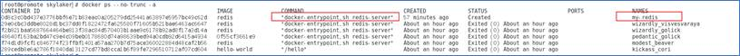

我们加上command试试

# 6. 仓库

## 6.1. 官方仓库

镜像既然是文件，当然需要有保存的地方，那保存在哪里呢？如何保存？我们每次docker pull 的镜像是哪来的？

仓库，保存镜像的地方，其实也就相当于代码仓库了。

docker官方镜像仓库地址：https://hub.docker.com，保存了大部分常用的镜像，我们可以注册并保存自己的私有镜像。

**1)**      注册后登录，下拉账号，点击My Profile，可以查看自己创建的仓库

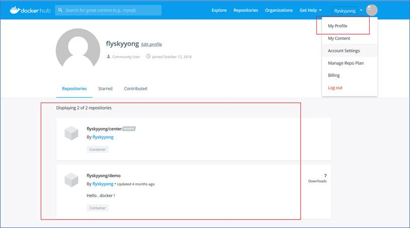

**2)**  客户端登录：**docker login**


上传推送镜像到自己的仓库中: **docker push [DockerHub****注册用户名/镜像名]**


由于某些你懂的原因，国内访问外网异常慢，经常上传不上去，这里我也没耐心了，先截上面的图~~~

## 6.2.  私有仓库

很多时候企业级开发为了安全起见不会将仓库放到公共平台上，虽然可以创建私有仓库，所以需要搭建自己的私有的仓库。

这里我们可以利用官方提供的registry镜像来搭建本地私有镜像。

**1)**   **搭建：**

```
docker run -it -d -p 5000:5000 -v /opt/docker:/var/lib/registry registry
```

Ø  -d从后台启动的方式镜像启动

Ø  -p 暴露端口，容器内部的5000绑定到宿主机的5000端口上

Ø  -v数据卷挂载：<宿主机目录>:<容器目录>


其实我们可以看到私有仓库本质上就是一个以docker容器形式存在的服务对象。

**2)**      **上传镜像：docker push [私有仓库地址：端口]/[镜像名称]：Tag**


我们在上传镜像到官方仓库的时候镜像是以**账号名称：镜像名称**形式上传的，账号名称就是为了定位我们个人的仓库地址。这里我们要上传到私有仓库，那么账号名称换成私有仓库地址即可定位私有仓库地址。

可在线查看私有仓库镜像：


我们可以进行下载：


# 7. 数据卷

在使用Docker的过程中，需要对一些数据进行持久化，我们知道数据持久化一般就是写入文件或者保存到数据库中，理论上数据库数据本质上也是磁盘文件。Docker数据持久化可以通过数据卷来实现。

## 7.1.   数据卷

**1)**   **基本概念**

数据卷（Data Volumes）：可供容器使用的特殊目录，它将主机操作系统目录直接映射进容器。可以大致用下面图示表示：


**2)**   **数据卷特性**

* 数据卷可以在容器之间共享和重用，容器间传递数据将变得高效方便；

* 对数据卷内数据的修改会立马生效，无论是容器内操作还是本地操作；

* 对数据卷的更新不会影响镜像，解耦了应用和数据；

* 卷会一直存在，直到没有容器使用，可以安全地卸载它。

**3)**  **数据卷创建**

Ø  默认方式

命令: **docker run [启动参数] --name [容器名称] -v [数据卷名称]  [镜像名称]  [bash]**

例如：docker run -ti -P --name ubuntu-v1 -v /test/data  ubuntu bash

这里我们以ubuntu镜像为基础，创建了一个名为ubuntu-v1的容器，并且使用终端绑定方式打开，同时用**-v参数在容器内创建了一个数据卷/test/data**。我们在进入容器后查找后确实发现了对应的文件目录。


既然数据卷是要映射宿主机环境目录，那么这里我们并没有指定宿主环境目录，应该是自动默认了，那对应的目录是哪个呢？我们可以使用命令：**docker inspect -f {{.Mounts}} ubuntu-v1**

查看容器对应挂载情况


Ø  指定挂载主机目录

命令：**docker run [****启动参数] --name [容器名称] -v [主机目录]:[数据卷名称] [镜像名称]  [bash]**

我们可以在-v参数中直接指定宿主机目录映射到容器中的数据卷，例如：

docker run -ti -P --name ubuntu-v2 -v /opt/data:/test/data ubuntu bash


这里我们将宿主机目录的/opt/data目录挂载到容器ubuntu-v2中的/test/data数据卷，相当于做了一个映射。

理论上不论我们在宿主挂载目录还是在容器数据卷操作数据，对应的另一方都会同步。我们现在尝试在数据卷增加一个文件，看看宿主挂载目录是否会同步：


但是发现提示权限不足！懵逼~~~

原因：CentOS7中的安全模块SELinux把权限禁掉了，可以通过以下方式解决挂载的目录没有权限的问题：在运行容器的时候，给容器加特权，及加上**--privileged=true**参数。使用该参数，容器内的root拥有真正的root权限.否则，容器内的root只是外部的一个普通用户权限。


加上权限后我们再创建文件，可以再宿主机目录查找到对应的文件。

Docker挂载数据卷的默认权限是读写（rw），用户也可以通过ro指定为只读：


## 7.2. 数据卷容器

**1)**      **基本概念**

数据卷容器（Data Volume Containers）：使用特定容器维护数据卷。从名称上可以看出数据卷容器本质上是一个容器，只不过这个容器专门提供数据卷给其他容器使用，即可以实现不同容器之间数据的同步。


其实数据卷容器就是例如我们上一节数据卷中创建的容器，不过其内部有数据卷罢了，它现在被当作中间公共数据容器了，类似与数据库了。

**2)**      **创建操作**

先创建一个数据卷容器，命令就是上面创建数据卷的命令：


下面创建两个容器挂载数据卷到这个数据卷容器ubuntru-v4的数据卷/data，首先

命令格式：**docker run [容器启动参数] --volumes-from [数据卷容器名称]  --name [当前容器名称] [当前容器镜像] [bash]**

我们直接利用--volumes-from指明要挂载的数据卷容器：

docker run -ti --volumes-from ubuntu-v4  --name ubuntu-v5 ubuntu bash

docker run -ti --volumes-from ubuntu-v4  --name ubuntu-v6 ubuntu bash


需要注意的是，由于直接run ubuntu会立即结束，所以我们这里都是以终端绑定方式启动的数据卷容器以及使用容器，所以对于容器ubuntu-v5和ubuntu-v6的命令都是在宿主机CentOS中重新启动命令终端执行的。

理论上在数据卷容器中或者使用数据卷容器的容器中我们对数据卷目录都会同步可显示，例如：

ubuntu-v6中新建文件


则ubuntu-v5容器和数据卷容器ubuntu-v4都可见：


如果删除了挂载的容器（包括dbdata、db1和db2），数据卷并不会被自动删除。如果要删除一个数据卷，必须在删除最后一个还挂载着它的容器时显式使用docker rm -v命令来指定同时删除关联的容器。

## 7.3. 数据迁移

利用数据卷容器对其中的数据卷进行备份、恢复，以实现数据的迁移。

**1)** **备份**

命令：**docker run --volumes-from [要备份的数据卷容器名称] -v [宿主机目录]:[当前容器数据卷目录] --name [当前容器名称] --privileged=true [当前容器镜像]  tar -cvPf [备份文件保存的目录]  [需要备份的数据卷]**

例如：docker run --volumes-from ubuntu-v4 -v $(pwd):/backup --name ubuntu-v7 --privileged=true  ubuntu  tar  -cvPf  /backup/backup.tar  /data

这里我们利用ubuntu镜像生成一个名为ubuntu-v7的容器，它首先挂载数据卷容器ubuntu-v4；然后自己又生成了数据卷/backup，对应宿主机当前目录；创建容器后立即执行备份打包命令，即将从ubuntu-v4共享的数据卷/data打包成backup.tar文件，保存到自己新增的/backup目录。

这里需要注意命令需要加上权限--privileged=true以免造成启动容器后无权限执行打包命令，另外tar命令需要加上-P参数，因为tar默认为相对路径，使用绝对路径的话就回报这个错，可以使用-P参数（注意大写）解决这个问题。


因为/backup是数据卷目录，而宿主机当前目录映射该目录，那么在宿主机当前目录下应该有备份的backup.tar文件，我们验证下：


**2)** **恢复**

现在需要将数据恢复到另一个容器，如何做呢？


即在要恢复到的容器挂载实现备份的容器存放备份文件的数据卷，这样的话当前容器共享了备份目录，就可以进行对备份文件的解压操作了。

# 8. 网络

容器作为独立的生命体，运行时必然涉及与外界的交互，这就关系网络相关的内容，本章我们主要看下端口映射相关的内容，先不了解容器网络模式的内容（相关内容可以参考：https://www.cnblogs.com/zuxing/articles/8780661.html），因为一般我们经常需要配置的就是网络端口了。

## 8.1. 端口绑定

容器在运行的时候可能需要被外部应用访问，例如MySQL容器，我们知道平时在连接访问计算机上安装的MySQL服务的时候需要设置连接端口，那么容器化的MySQL如何知道它的端口呢？


这里有张网络图可以很好的解释，就是对于MySQL容器来说它自身还是默认提供3306端口的，但是我们访问肯定时访问的宿主机物理端口，这就需要将容器端口与宿主机端口映射，例如将容器端口3306映射到宿主机3000，这样我们外部应用访问时可以直接访问3000端口了。

启动MySQL容器：**docker run --name mysql-v1 -d -p 3306:8806 -e MYSQL_ROOT_PASSWORD=root mysql:5.6**


这里我们启动了一个MySQL容器，端口映射到宿主机8806，并且设置用户root密码为root。

我们利用客户端连接试试：

## 8.2. 容器通信

在实际应用中我们的业务应用和提供数据接口服务的应用可能都通过容器的方式部署，那么就涉及容器之间的通信。一种实现方式是大家都映射出端口到宿主机，例如图示：


但是这种这种直接暴露端口的方式可能不太安全，另外一种相对安全的方式就是容器间可以直接通信访问：


例如上一节案例我们已经创建了MySQL容器mysql-v1，现在我们有个Tomcat应用想要和其进行通信，那么可以这样启动Tomcat容器：


 --link参数设置当前容器连接到的网络服务容器。格式为--link name:alias,其中name是要连接的容器名称，alias是这个连接的别名。

Docker在两个容器之间创建了安全隧道，而且不用映射它们的端口到宿主机上，所以上面mysql-v1启动时候我们不需要加-p 3306:8806这样的设置端口映射参数，以保证安全性。

我们进入tomcat-v1容器查看连接MySQL情况。


# 9. Dockerfile

## 9.1. 前言说明

在前面的操作过程中我们都是利用Docker已有的镜像创建生成容器，进行各种操作，那么我们是否可以自定义镜像文件呢？答案是可以的。自定义镜像镜像文件正是我们部署我们生产应用的首要条件，例如基于Java的docker镜像文件，结合我们自己的生成应用以及依赖环境，可以打包生成一个新的镜像，在需要部署运行的时候直接生成容器运行即可，无需各种冗杂、重复的配置工作。那么下面我们就来了解下如何自定义镜像。

## 9.2. 基本概念

### 9.2.1. 何为Dockerfile?

Dockerfile用大白话解释就是一个配置文件，里面有各种命令，可用来构建自定义Docker镜像。作用好比如Maven的pom文件一样，可依据设置的指令执行相关的动作。

### 9.2.2. 组成结构

一般Dockerfile分为四个部分：基础镜像信息、维护者信息、镜像操作指令和容器启动时的指令，对应的命令列表：

| **部分**           | **命令**                                                 |
| ------------------ | -------------------------------------------------------- |
| 基础镜像信息       | FROM                                                     |
| 标签、维护者信息   | LABEL、MAINTAINER                                        |
| 镜像操作指令       | RUN、COPY、ADD、EXPOSE、WORKDIR、ONBUILD、USER、VOLUME等 |
| 容器启动时执行指令 | CMD、ENTRYPOINT                                          |

### 9.2.3. 注释

注释行以#开头即可

## 9.3. 命令详解

**1)**   **FROM**

指定基础镜像，如：


为什么需要指定基础镜像呢？这个就好比如建房子需要地基、我们运行Java应用需要JRE环境一样，我们自定义生成的镜像用来执行各种命令操作等，肯定需要一个依赖环境了。

**2)**  **LABEL**

设置标签信息，可用来设置自定义镜像的一些基本信息等，例如：


**3)** **MAINTAINER**

设置作者信息，例如：


**4)**   **RUN**

在镜像内部执行的命令，可用来执行一些配置、设置环境等，例如我们在基于ubuntu的基础自定义镜像中先安装nginx环境，然后运行web应用。例如：


这里我们把一句话生成输出到readme.txt文件中。

**5)** **COPY**

将所在主机中的文件复制到容器内，比如我们需要运行某个Java应用，那么在生成自定义镜像的时候得先将这个应用文件集成到镜像中啊：


这里我们把要部署运行的jar包文件复制到镜像中，为了后续容器运行时直接启动运行。

**6)** **ADD**

使用和作用同COPY，但是不同的地方在于ADD会对压缩文件（tar, gzip, bzip2, etc）做提取和解压操作。

**7)** **EXPOSE**

暴露镜像端口，需要注意的是这边暴露的端口并不意味着在宿主机中可以直接根据这个端口访问，同样的需要在容器启动的时候通过-p参数设置宿主机端口映射，或者-P随机端口映射：


**8)** **WORKDIR**

指定工作目录，后续命令操作都是基于此目录：


**9)** **USER**

指定容器启动后以哪个用户身份去运行：


**10)**   **VOLUME**

挂载容器数据卷，即将宿主机某个目录与容器中某个目录映射，主要用来存放数据，例如：


这里设置容器中当前工作目录下的log目录为数据卷，那么后期容器实际运行的时候这个下面的文件会实时同步到对应的随机分配的宿主机映射目录中。

**11)** **CMD**

容器启动的时候执行的命令，相当于在定义镜像的时候就约定好了运行容器后执行的命令，例如：


当有多个CMD的时候，只有最后一个生效。

**12)** **ENTRYPOINT**

用法和作用同CMD，例如：


但是CMD和ENTRYPOINT是存在差异的：

CMD的命令会被 docker run 的命令覆盖，ENTRYPOINT不会

Ø  只存在CMD时：//TODO

Ø  只存在ENTRYPOINT时： //TODO

Ø  CMD、ENTRYPOINT都存在时： //TODO

## 9.4. 操作步骤

以下以实际应用为例子说明如何构建自定义镜像。

目标：基于Java的镜像部署一个SpringBoot应用——HelloDocker。

### 9.4.1. 编写微服务应用

我们利用Eclispe创建了一个SpringBoot应用——HelloDocker，具体步骤这里省略。我们看下主要的配置文件：


这里我们设置应用端口为8099，同时设置了应用日志信息保存到应用同级的log目录下。

我们的测试服务内容：


即我们在应用启动后，浏览器访问 http://{IP}:{端口}/hellodocker/rest/v1.0/hello时应该得到对应的输出内容：Hello Docker , Today IS A Good Day !

应用编写完成Maven打包生成jar包：


### 9.4.2. 创建镜像操作目录

我们在Linux上创建一个我们构建镜像的目录：dockerdir，当然这个目录可以是任意位置，任意名称的，我们主要用来方便构建镜像时相关文件一起不混乱。

我们将之前生成的应用jar包拷贝至dockerfile同级目录： 


### 9.4.3. 编写构建自定义镜像脚本

新建dockerfile文件：touch dockerfile 、vim dockerfile，注意文件名称必须是dockerfile:


### 9.4.4. 编译生成镜像

在当前目录输入命令：**docker build -t [自定义镜像名称] .** 编译生成镜像文件，注意最后的 . 点号，这个是指当前目录，即docker在当前目录寻找dockerfile文件，根据文件中的指令编译生成自定义镜像文件。


### 9.4.5. 运行容器实例

我们成功生成自定义镜像myapp，我们可以启动运行容器：


立即打开浏览器访问服务压压惊，哈哈，没毛病，成功：


现在我们再仔细核实下我们在生成镜像脚本文件中的设置是否真正成功。查看运行容器内部是否有我们指定生成的readme.txt、/app/log目录下是否有应用启动日志文件：


结果验证时对应的文件都是存在的，与预期一致。

另外我们使用VOLUME命令挂载数据卷，但是并没有指定宿主机对应的目录，那么我们挂载的数据卷在宿主机哪个目录呢？


进入宿主机目录查看：


可以看到日志文件同容器中的一致，这样保证了日志数据的安全性，即使容器不存在日志数据依然可以保留，当然这里只是测试用日志文件而已，实际中肯定是保存重要的业务数据等